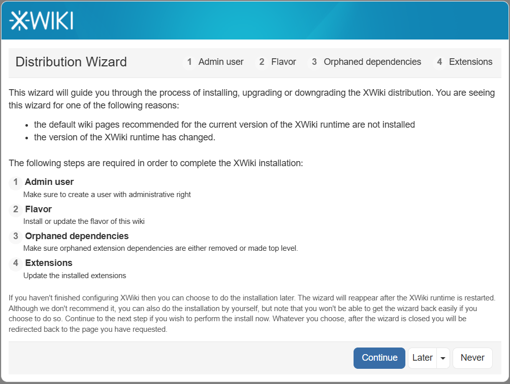
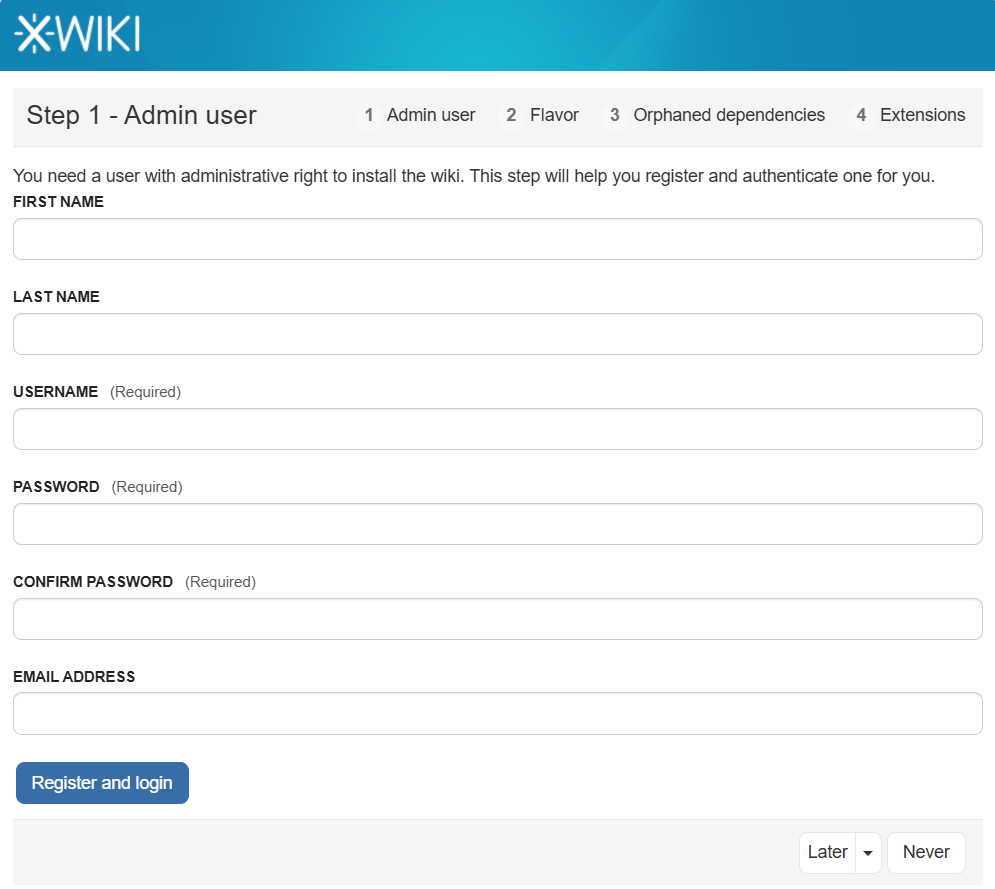
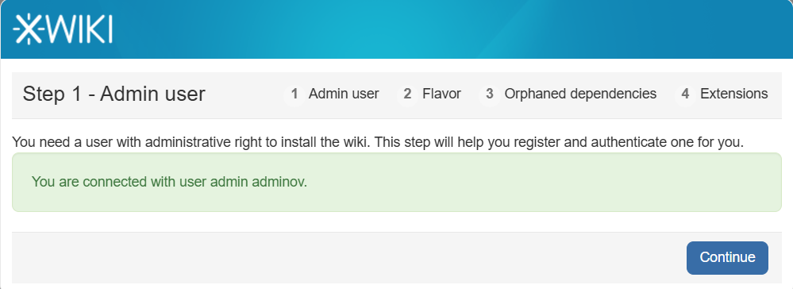
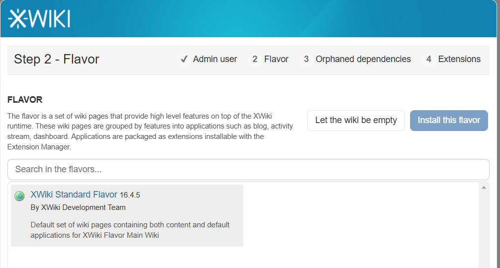
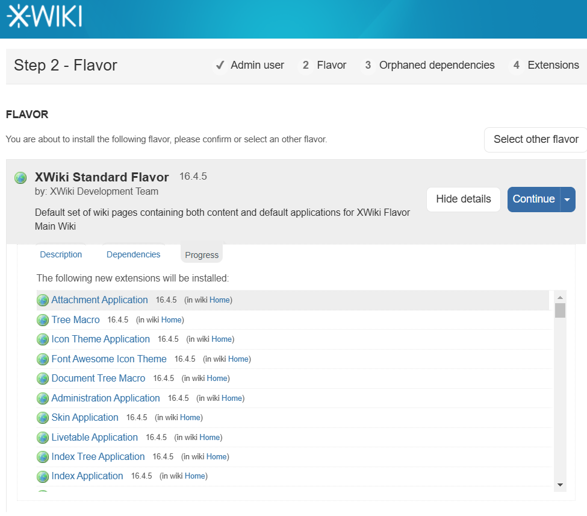
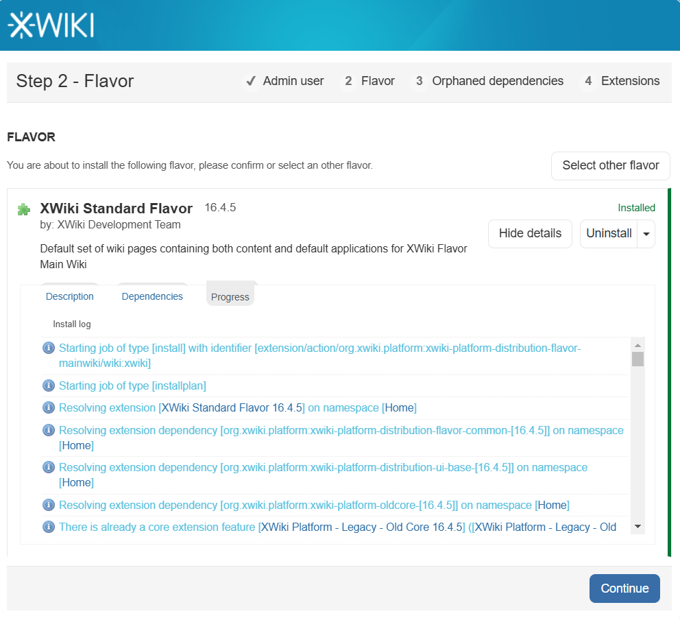
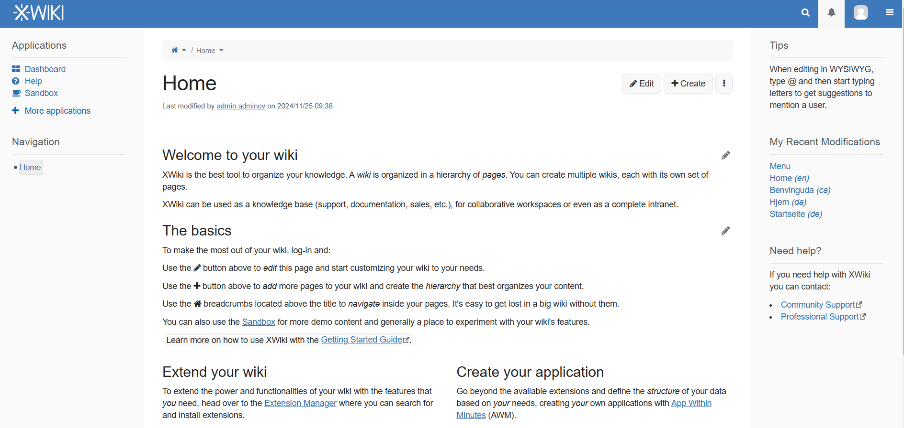
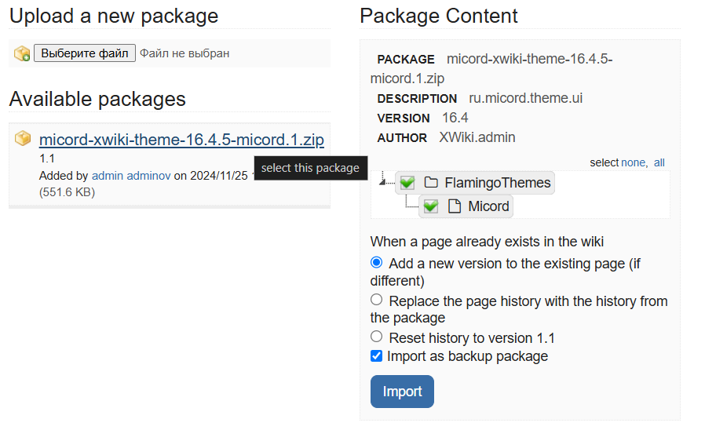
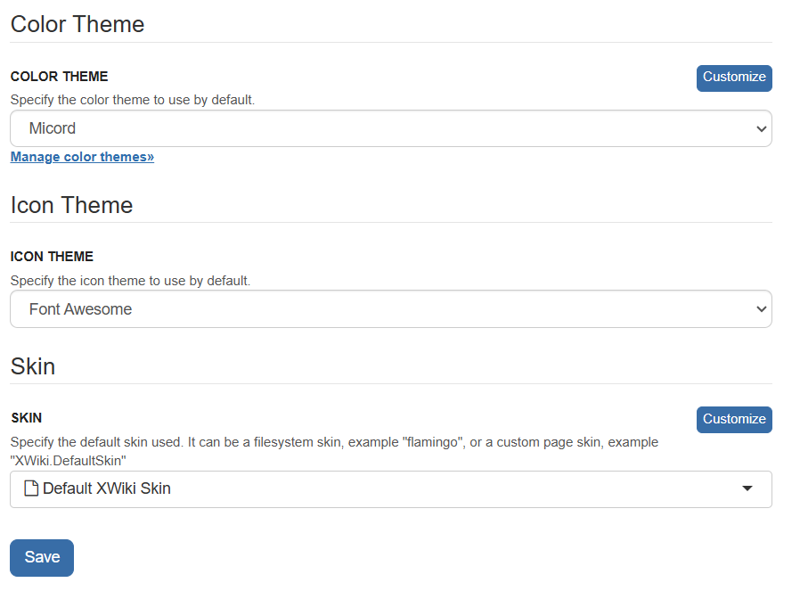
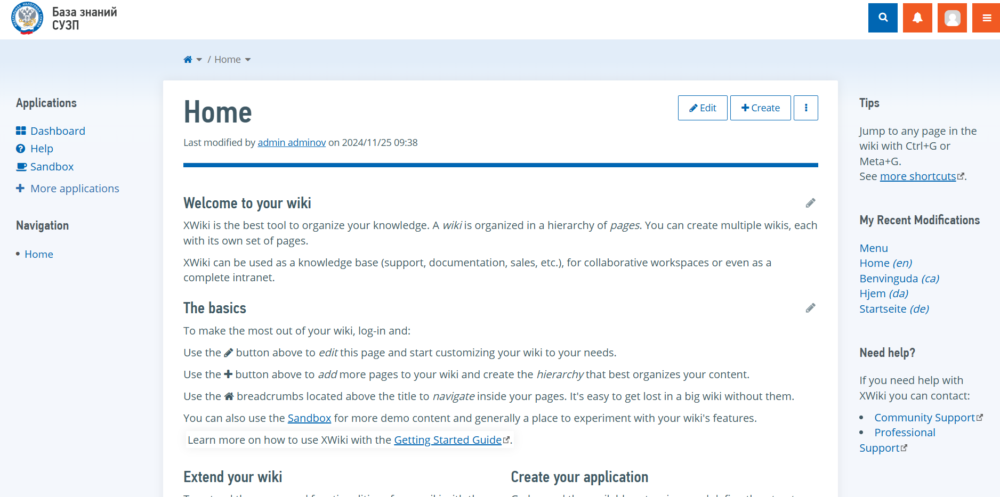

# Сборка xwiki и установка темы Micord в проект xwiki

### Сборка docker контейнера
1. Переходим в директорию 16.4/postgres-tomcat в этой директории находится Dockerfile, 
который собирает образ xwiki версии 16.4.5 с расширениями. Расширения требуются чтобы не обращаться
к внешним источникам, поэтому для запуска проекта xwiki не требуется доступ в интернет. Так же скачивается
драйвер postgresql для корректного подключения к hibernate (hibernate.cfg.xml)
2. Команда для запуска Dockerfile `docker build -t <название образа> . --no-cache`. Флаг `--no-cache` гарантирует, что сборка выполняется с нуля без использования кешированных слоев.
3. Команда для запуска docker-compose `docker-compose up --build`. Запускает контейнеры xwiki из собранного образа Dockerfile. Флаг `--build` пересобирает образ, если были внесены изменения в Dockerfile
по порту 8080 и postgresql
___
### Инициализация приложения xwiki
1. После сборки контейнеров переходим `http\https:<домен>:8080`. Будет происходить инициализация приложения
2. Всплывёт окно. Нажимаем **Continue** 

___
3. В следующем окне происходит регистрация админа. После нажимаем **Register and login**, когда вы успешно зарегистрируетесь нажимать **Continue**

___

___
4. Если расширения успешно установились и нет доступа к интернету, то отобразиться расширение **_Xwiki Standard Flavor_**, 
нужно нажать на него и после нажать на **Install this flavor**, а после нажать **Install** на самом расширении.

___
5. После загрузки расширения мы увидим какие зависимости подтянулись с этим расширением и после нажимаем **Continue**. 
Во время скачивания зависимостей нежелательно обновлять страницу, может произойти зацикливающая установка зависимостей. 
После успешной установки мы увидим надпись **Installed** и можно нажать на **Continue** и на следующем этапе Step 5 - Report 
тоже нажимаем Continue

___

___
6. После успешной установки мы перейдём на домашнюю страницу xwiki.
 

___
### Установка темы Micord
1. Для установки темы, нужно скачать из нашего нексуса архив темы Micord
   - [Скачать архив с темой Micord](https://repo.micord.ru/repository/ext-releases-local/ru/micord/task-tracker/micord-xwiki-theme/16.4.5-micord.1/micord-xwiki-theme-16.4.5-micord.1.zip)

2. Перейти в админ панель 
3. **Administer Wiki > Content > Import > Выбрать файл(Выбираем архив, который скачали) > 
Нажать на имя архива > Import**

4. После этих действий увидим сообщение **Import successful**. 
5. Потом переходим в Look & Feel > Themes > Color Theme > Micord > Save

6. При успешном импорте мы увидим изменения всей темы.

